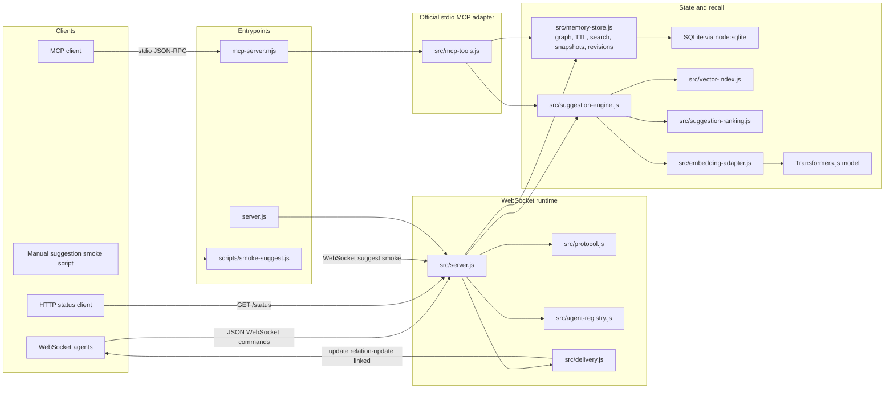
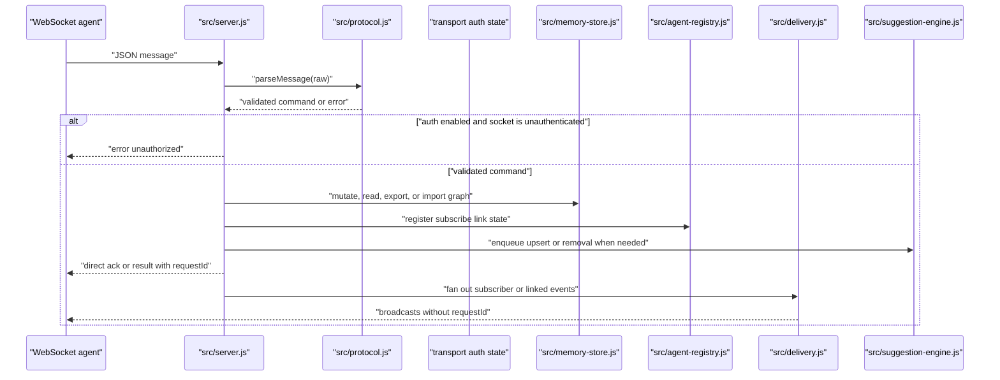
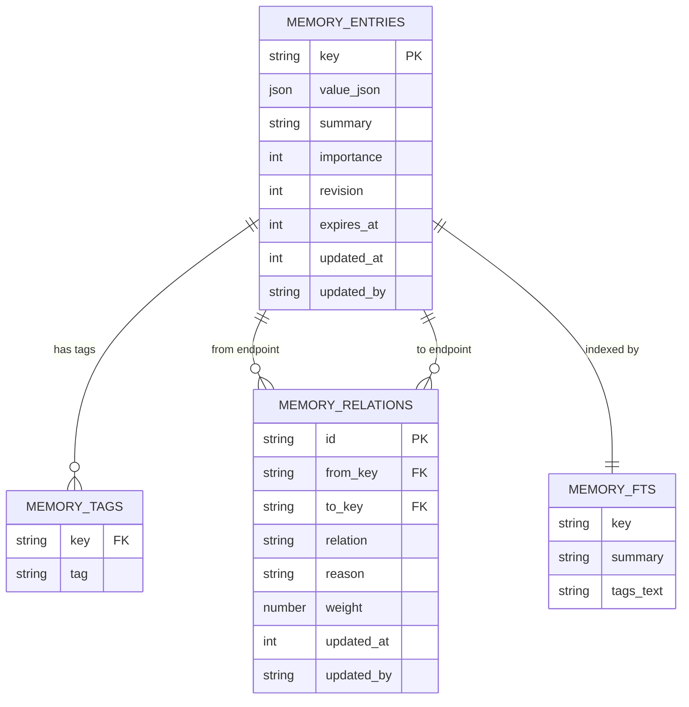
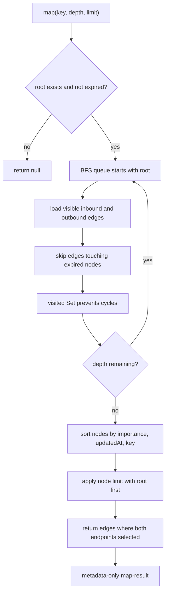
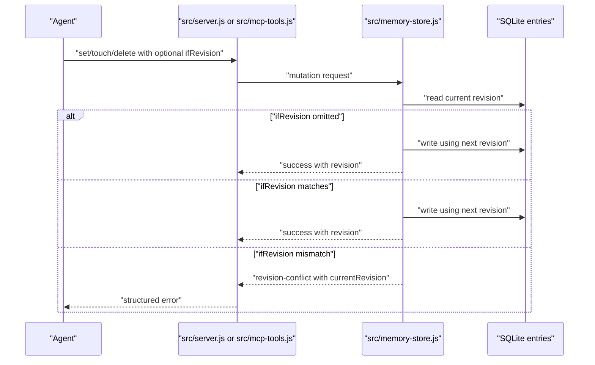
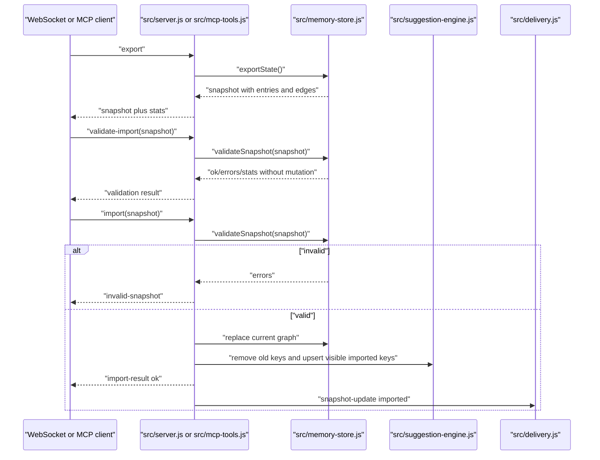
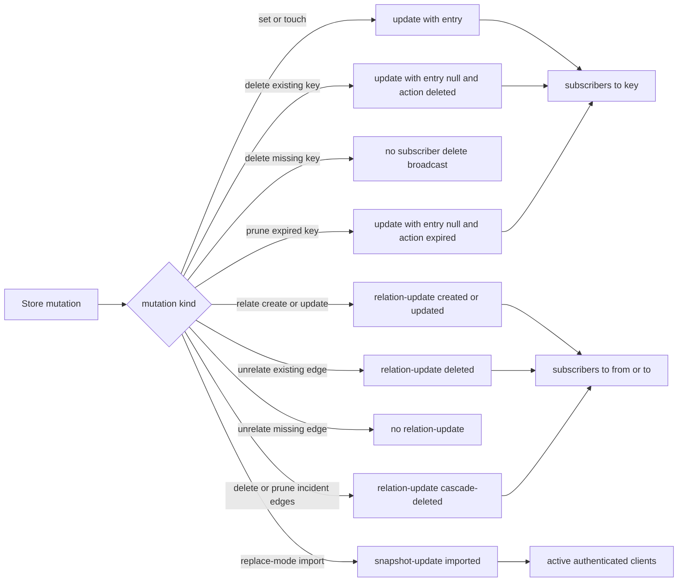
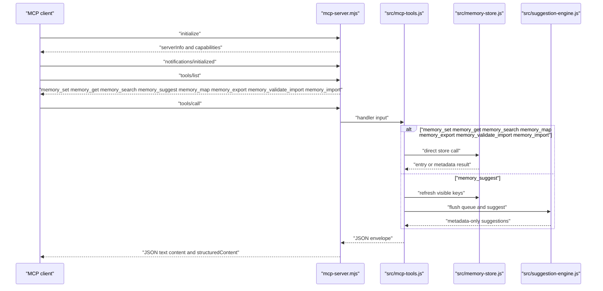
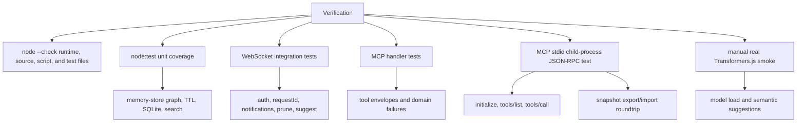

# sharedMemory System Diagram

## High-Level Architecture

## WebSocket Command Flow

## Memory Store Model

## Graph Recall Flow

## Versioned Write Flow

## Snapshot Flow

## Notification Rules

## MCP Tool Flow

## Operational Modes

| Mode                 | Entry                                   | Persistence                                   | Suggestions                                     | Auth                                   |
| -------------------- | --------------------------------------- | --------------------------------------------- | ----------------------------------------------- | -------------------------------------- |
| Local WebSocket dev  | `npm start`                             | In-process SQLite unless `MEMORY_FILE` is set | Disabled by default                             | Disabled unless `MEMORY_TOKEN` is set  |
| Persistent WebSocket | `MEMORY_FILE=data/memory.db npm start`  | File-backed SQLite WAL                        | Disabled by default                             | Optional bearer token                  |
| Semantic WebSocket   | `MEMORY_SUGGEST_ENABLED=true npm start` | Same as server config                         | Enabled and lazy-loads model on first embedding | Optional bearer token                  |
| MCP stdio            | `npm run mcp`                           | Honors `MEMORY_FILE`                          | Disabled unless explicitly enabled              | `MEMORY_TOKEN` ignored for local stdio |
| Real-model smoke     | `npm run smoke:suggest`                 | Uses running WebSocket server                 | Requires server suggestions enabled             | Uses `MEMORY_TOKEN` if configured      |

## Verification Surface

